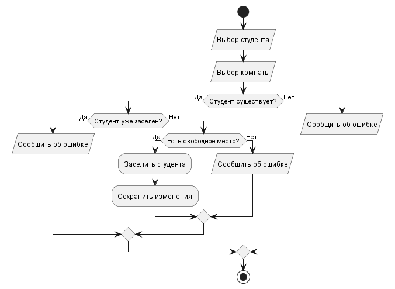
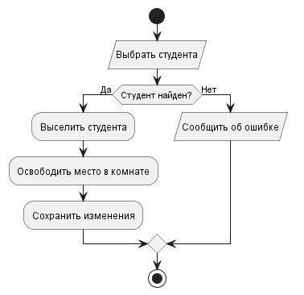
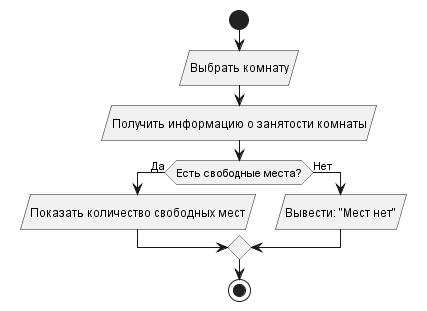

# Residio

Residio — консольное приложение для учёта комнат общежития и проживающих в нём студентов. Проект предназначен для автоматизации заселения и выселения студентов и контроля занятости комнат.

Автор: Климов Василий Андреевич, группа 26-ИВТ-4-2

## Возможности
В проекте предусмотрены следующие основные возможности:

- хранение информации о комнатах и студентах;
- заселение студента в комнату;
- выселение студента из общежития;
- поиск информации о студентах;
- просмотр занятости комнат и количества свободных мест;
- просмотр студентом информации о своей комнате и соседях;
- просмотр администратором списка студентов в конкретной комнате;
- хранение данных в файлах.
## Предметная область
Комната: номер, этаж, количество занятых и свободных мест.
Студент: ФИО, учебная группа, комната, в которой он проживает.

Задача системы — удобный учёт студентов и отслеживание статуса комнат, а также снижение вероятности ошибок в данных о проживании.

## Пользователи и роли

| Роль | Возможности |
|---|---|
| **Администратор общежития** | Изменяет информацию о комнатах и студентах, заселяет и выселяет студентов, следит за свободными местами |
| **Студент** | Узнаёт номер своей комнаты и информацию о соседях |

## Структура проекта
 
```text
Residio/
│
├── docs/                         # Документация проекта
│   └── diagrams/                 # Диаграммы PlantUML
│        ├── check-in.png         # Изобрадение диаграммы заселения 
|        ├── check-in.puml        # PlantUML заселение
|        ├── check-out.png        # Изобрадение диаграммы высления
|        ├── check-out.puml       # PlantUML высление
|        ├── free-place.png       # Изобрадение диаграммы проверки свободных мест
|        ├── Use Case Diagram.png # Изобрадение UseCase диаграммы
|        └── usecase.puml         # PlantUML UseCase диаграммы   
|
├── src/                          # Исходный код приложения
│   └── residio/
|        ├── __init__.py          # Инициализация Python-пакета
│        ├── main.py              # Точка входа в приложение
│        ├── auth.py              # Логика авторизации
│        ├── menu.py              # Консольное меню
│        │
│        ├── database/            # Работа с базой данных
│        │
│        ├── models/              # Модели предметной области
│        │
│        ├── repositories/        # Доступ к данным
│        │
│        └── services/            # Бизнес-логика приложения
|
├── tests/                        # Автоматизированные тесты
|    ├── __init__.py
|    └── test_main.py
├── .gitignore                    # Исключения для Git
├── requirements.txt              # Список зависимостей проекта
└── README.md                     # Документация проекта
```
### Основные компоненты

#### `main.py`

Точка входа в приложение. Выполняет инициализацию необходимых компонентов и запускает программу.

#### `menu.py`

Содержит логику взаимодействия с пользователем через консольное меню.

#### `auth.py`

Отвечает за регистрацию и авторизацию пользователей.

#### `models`

Содержит модели основных сущностей предметной области, включая пользователей, книги, авторов и бронирования.

#### `repositories`

Содержит компоненты, отвечающие за получение, добавление, изменение и удаление данных.

#### `services`

Содержит бизнес-логику приложения и обеспечивает взаимодействие между пользовательским интерфейсом и слоем доступа к данным.

#### `database`

Содержит компоненты, необходимые для работы с базой данных и её инициализации.

## Архитектура
 
Приложение проектируется по трёхуровневой архитектуре.
 
```text
Пользователь
     │
     ▼
Presentation Layer (консольный интерфейс)
     │
     ▼
Business Logic Layer (заселение, выселение, проверка свободных мест)
     │
     ▼
Data Layer (хранение данных в файлах)
```
Такое разделение отделяет пользовательский интерфейс от бизнес-правил и работы с данными.
 
| Уровень | Назначение |
|---|---|
| Presentation Layer | Взаимодействие с пользователем через консоль |
| Business Logic Layer | Основные правила системы |
| Data Layer | Хранение и получение информации |

## Блок-схемы процессов
Заселение студента




Высление студента 





Проверка свободныз мест




## Работа в Visual Studio Code

Для запуска проекта в Visual Studio Code необходимо выбрать интерпретатор Python из виртуального окружения:

```text
.venv\Scripts\python.exe
```

Конфигурация запуска находится в файле:

```text
.vscode/launch.json
```

Проект запускается как Python-модуль:

```text
src.libtrack.main
```

Это позволяет корректно использовать пакетную структуру проекта и абсолютные импорты.


## Требования
 
Для запуска проекта необходимо установить:
 
* Python 3;
* Git.
  
## Установка
 
```bash
git clone https://github.com/klimovvasko-stack/Residio.git
cd Residio
```
 
## Запуск приложения
 
Из корневой папки проекта выполните:
 
```bash
python src/main.py
```

После запуска в консоли будет отображено главное меню приложения.

```text
===== Библиотека =====
1. Вход
2. Регистрация студента
3. Высление студента
4. Проверка свободныз мест
0. Выход
```

Пользователь может выбрать необходимое действие, введя соответствующий номер.
 
## Используемые технологии
 
* [Python](https://www.python.org/);
* Git и GitHub;
* Visual Studio Code;
* PlantUML и Markdown для документации.
## Лицензия
 
Проект является учебным.